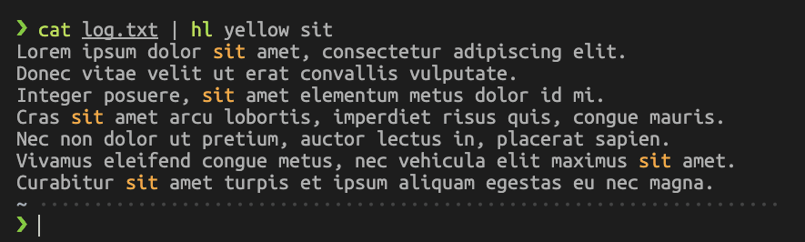
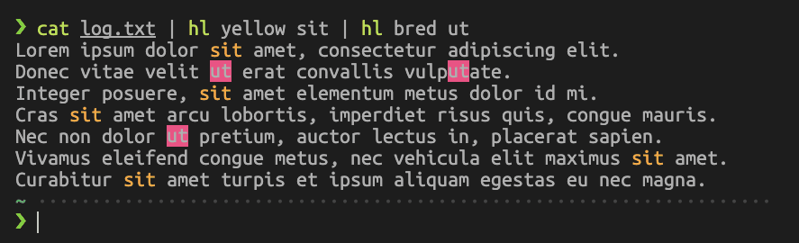
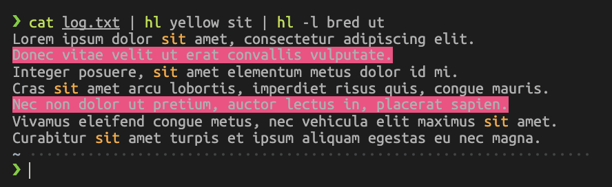

# scripts
A collection of ZSH scripts that make my life easier

1. `pyinit` / `pyactivate`: Simple tools for managing python virtual environments.
    -  Stores environment in a `.venv` folder. `pyinit` to create and activate, `pyactivate` to activate.
    -  `pyinit <dirname>` creates an environment in `<dirname>`, creating the directory if it doesn't exist.
    -  `pyinit` without arguments creates an environment in the current directory.

2. `srczsh` re-sources `~/.zshrc`. Pretty simple but saves some keystrokes.

3. `myip` echoes the IP address of `en0`.

4. `flag` is not mine, it's from @gpiper's [gist](https://gist.github.com/giper45/486162af10f69a90fa3315a09af58787) from SO. It grabs the documentation for a specific flag from a `man` page.

5. `cptemp` and `mvtemp` create a new directory in `/tmp/` in the form `TEMP_XXXX`. They then `cp` or `mv` their arguments to the temp folder. If they're given the `-n` flag, they will echo the new path. Otherwise, they `cd` you into it. Useful for creating disposable testing environments.

6. `cltemp` removes all directories in `/tmp/` that fit the form `TEMP_XXXX`. It shows the contents of these directories using `tree(1)` to confirm first. If you don't have and don't want to install `tree`, you can replace it with an `ls` or a `find`.

7. `hl` is a simple tool for finding and highlighting text from `stdin`. It works like this: `hl <color> <token>`. If given the `-l` flag, it will highlight entire lines. It has definitions for `red`, `green`, `yellow`, `blue`, `magenta`, and `cyan`. You can also prepend a `b` to those colors to change the background color (highlight) of the text:

